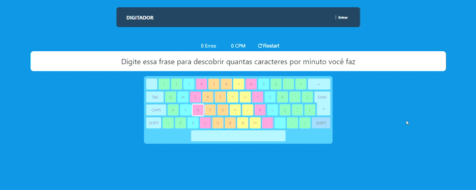

<h1 align="center">
  Digitador 🦾
</h1>

  <a href="https://digitador.vercel.app/" target="_blank">Live Demo</a>
  &nbsp;&nbsp;&nbsp;|&nbsp;&nbsp;&nbsp;
  <a href="#-projeto">Projeto</a>
  &nbsp;&nbsp;&nbsp;|&nbsp;&nbsp;&nbsp;
  <a href="#-tecnologias">Tecnologias</a>
  &nbsp;&nbsp;&nbsp;|&nbsp;&nbsp;&nbsp;
  <a href="#-como-executar">Como Executar</a>
  &nbsp;&nbsp;&nbsp;|&nbsp;&nbsp;&nbsp;
  <a href="#-licença">Licença</a>

  
  

## 💻 Projeto

  

Eu queria digitar mais rápido e com todos os meus dedos, ao pesquisar um pouco encontrei o [Ratatype](https://www.ratatype.com/) que tinha vários exercícios de digitação numa interface muito legal. Esse site realmente me ajudou a chegar no meu objetivo e eu consigo digitar bem melhor agora, mas durante as lições, foi bem chato não poder usar o layout de teclado ABNT2 e ficar com várias coisas bugando. Também senti falta de usar palavras em português com os acentos e suas peculiaridades.

Após essa experiencia, Eu me desafiei só por diversão a criar a mesma solução gamificada só que com um layout de teclado ABNT2 e exercícios em PT-BR.

Vou tentar continuar a melhorar o projeto e lançar novas features com o tempo para torna-lo realmente útil para os outros, assim como o Ratatype foi útil para mim.
## ✨ Tecnologias

* [React](https://pt-br.reactjs.org)
* [Next.js](https://nextjs.org)
* [Typescript](https://www.typescriptlang.org)
* [Styled Components](https://styled-components.com)
* [Jest](https://jestjs.io)
* [Plop](https://plopjs.com)

## 🚀 Como Executar

- Clone o repositório
- Instale as dependências com `yarn`
- Inicie o servidor com `yarn dev`

### ✅ Testes

Rode os testes com `yarn test` ou desenvolva enquanto testa com `yarn test:watch`

### 🔧 Criar Novos Componentes

para criar um novo componente com o plop, use `yarn generate {nome}`

## 📄 Licença

Esse projeto está sob a licença MIT. Veja o arquivo [LICENSE](https://github.com/gustavodaltoe/Digitador/blob/main/LICENSE) para mais detalhes.
